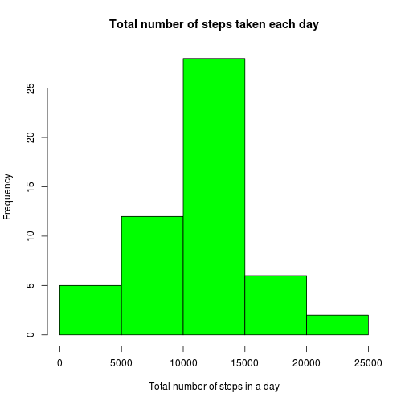
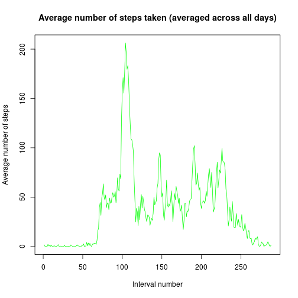
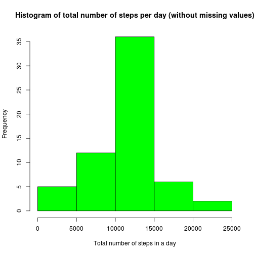
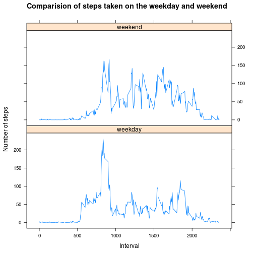

# Reproducible Research: Peer Assessment 1


## Loading and preprocessing the data

```r
# Extract and read activity data.
unzip("activity.zip")
act <- read.csv("activity.csv")
```


## What is mean total number of steps taken per day?
1.Make a histogram of the total number of steps taken each day

```r
# Calculate steps number per day
snpd <- aggregate(steps ~ date, act, sum)

# Plot histogram
hist(snpd$steps, col="green", 
     main="Total number of steps taken each day",
     xlab="Total number of steps in a day")
```

 

2.Calculate and report the mean and median total number of steps taken per day

```r
#Calculate mean and median.
snpd_mean <- mean(snpd$steps)
snpd_median <- median(snpd$steps) 
```

**Total number of steps taken per day mean is 10766 and median is 10765.**

## What is the average daily activity pattern?

1.Make a time series plot (i.e. type = "l") of the 5-minute interval (x-axis) and the average number of steps taken, averaged across all days (y-axis)

```r
# Calculate average number of steps in interval across all days
anspi <- aggregate(steps ~ interval, act, mean)

# Plot time series
plot(anspi$steps, type='l', col="green", 
     main = "Average number of steps taken (averaged across all days)",
     ylab="Average number of steps",
     xlab="Interval number")
```

 

2.Which 5-minute interval, on average across all the days in the dataset, contains the maximum number of steps?

```r
# Find 5-minute interval number, which contains the maximum number of steps
int_number <- anspi$interval[which.max(anspi$steps)]
```

**835 5-minute interval, on average across all the days in the dataset, contains the maximum number of steps.**

## Imputing missing values
1.Calculate and report the total number of missing values in the dataset (i.e. the total number of rows with NAs)

```r
# Count missing values
na_values <- sum(is.na(act))
```

**Total number of missing values in the dataset is 2304.**

2.Devise a strategy for filling in all of the missing values in the dataset. The strategy does not need to be sophisticated. For example, you could use the mean/median for that day, or the mean for that 5-minute interval, etc.

**I will use the mean for that 5-minute interval (across all days) to fill mising values.**

```r
fill_NA <- function(data) {
    # Calculate average number of steps in interval across all days
    anspi <- aggregate(steps ~ interval, data, mean)
    # Iterate over all rows
    for (i in 1:nrow(data)) {
        if (is.na(data$steps[i])) {
            # Fill mising values with mean
            data$steps[i] <- anspi$steps[anspi$interval == data$interval[i]]
        }
    }  
    data
}
```

3.Create a new dataset that is equal to the original dataset but with the missing data filled in.

```r
# New dtat set with filled in values
new_act <- fill_NA(act)
```

4.Make a histogram of the total number of steps taken each day and Calculate and report the mean and median total number of steps taken per day. Do these values differ from the estimates from the first part of the assignment? What is the impact of imputing missing data on the estimates of the total daily number of steps?


```r
# Calculate steps number per day
new_snpd <- aggregate(steps ~ date, new_act, sum)

# Plot histogram
hist(new_snpd$steps, col="green", 
     main="Histogram of total number of steps per day (without missing values)",
     xlab="Total number of steps in a day")
```

 


```r
#Calculate mean and median.
new_snpd_mean <- mean(new_snpd$steps) 
new_snpd_median <- median(new_snpd$steps) 
```

**Total number of steps taken per day (without missing date) mean is 10766 and median is 10766.**

**Mean didn't change and median changed a little bit, because I decided to fill mising values with mean for that 5-minute interval (this means that newly filled day will have same mean as days before changing missing value). You can these this effect in the histogram. Frequency only changed for the middle values, and extreme values frequency stayed in same level.**

## Are there differences in activity patterns between weekdays and weekends?

1.Create a new factor variable in the dataset with two levels – “weekday” and “weekend” indicating whether a given date is a weekday or weekend day.


```r
#Create new factor.
new_act$wday <- "weekday"
new_act$wday[weekdays(as.Date(new_act$date)) == "Sunday"] <-"weekend"
new_act$wday[weekdays(as.Date(new_act$date)) == "Saturday"] <-"weekend"
new_act$wday <- as.factor(new_act$wday)
```

2.Make a panel plot containing a time series plot (i.e. type = "l") of the 5-minute interval (x-axis) and the average number of steps taken, averaged across all weekday days or weekend days (y-axis). 


```r
#Plot panel.
library(lattice)
new_anspi <- aggregate(steps ~ interval + wday, new_act, mean)
xyplot(new_anspi$steps ~ new_anspi$interval | new_anspi$wday, layout = c(1, 2),
       type='l', xlab="Interval", ylab="Number of steps", 
       main="Comparision of steps taken on the weekday and weekend") 
```

 
